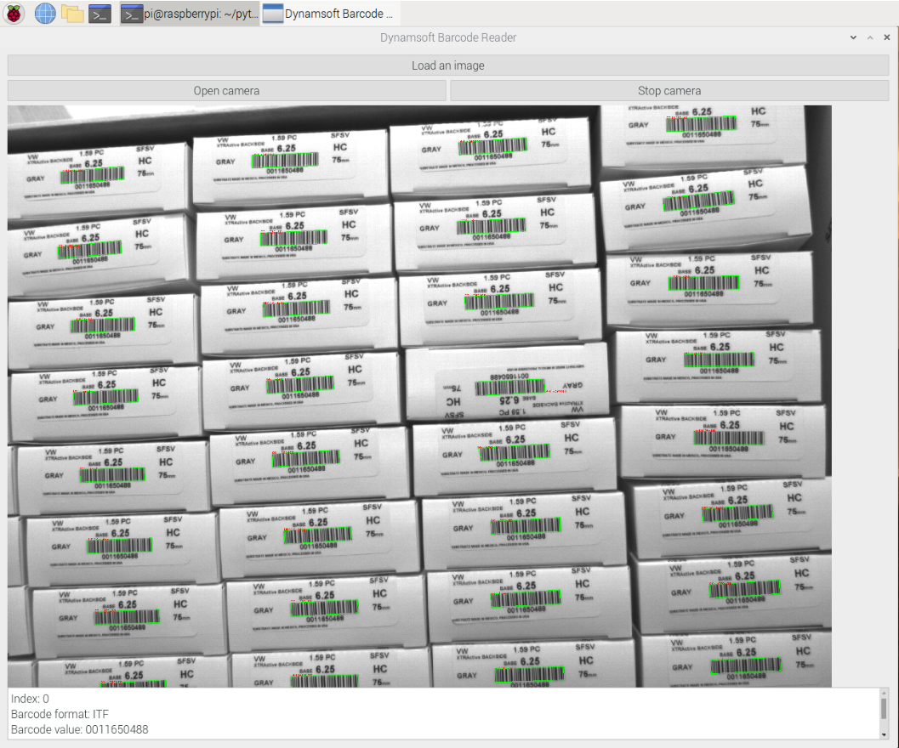
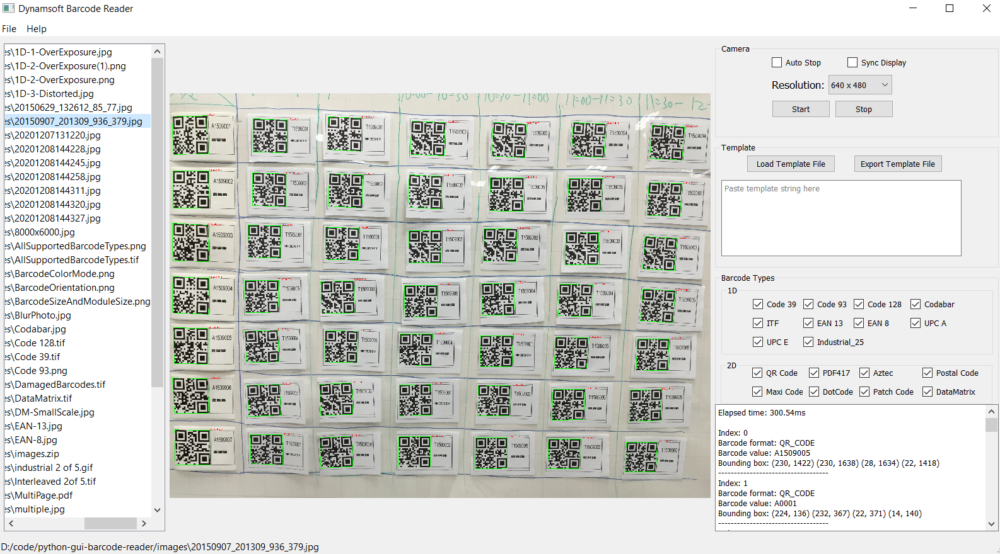

# Python Barcode Reader with Desktop GUI
This is a cross-platform GUI barcode reader application built with `Python 3`, `PySide6`, and the [Dynamsoft Python Barcode SDK](https://www.dynamsoft.com/barcode-reader/docs/server/programming/python/). It supports `Windows`, `Linux`, `macOS` and `Raspberry Pi OS`.


## Prerequisites
- **OpenCV**

    ```bash
    python3 -m pip install opencv-python
    ```

- **PySide6**
    
    ```bash
    python3 -m pip install PySide6
    ```

- **Dynamsoft Barcode Reader**

    ```
    python3 -m pip install dbr
    ```

- [Dynamsoft Barcode SDK License](https://www.dynamsoft.com/customer/license/trialLicense?product=dbr)


## Usage

- **Simple Demo**

    ```
    python3 app.py license.txt
    ```

    

- **Advanced Demo**

    The advanced demo supports reading barcodes from image files, webcam, and desktop screenshots:

    ```
    pyside2-uic design.ui -o design.py
    python3 app_advanced.py license.txt
    ```

    

    
## Blog
- [How to Create a Python Barcode Reader to Scan QR Code from Desktop Screen](https://www.dynamsoft.com/codepool/scan-qr-code-from-desktop-screen.html)
- [Advanced GUI Python Barcode Reader for Windows, Linux, macOS and Rasberry Pi OS](https://www.dynamsoft.com/codepool/gui-barcode-reader-windows-linux-macos.html)
